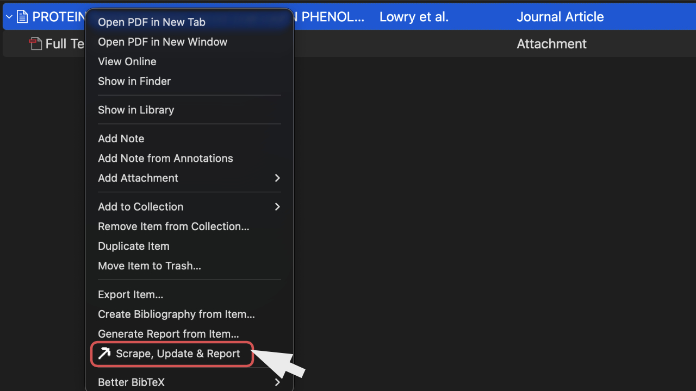
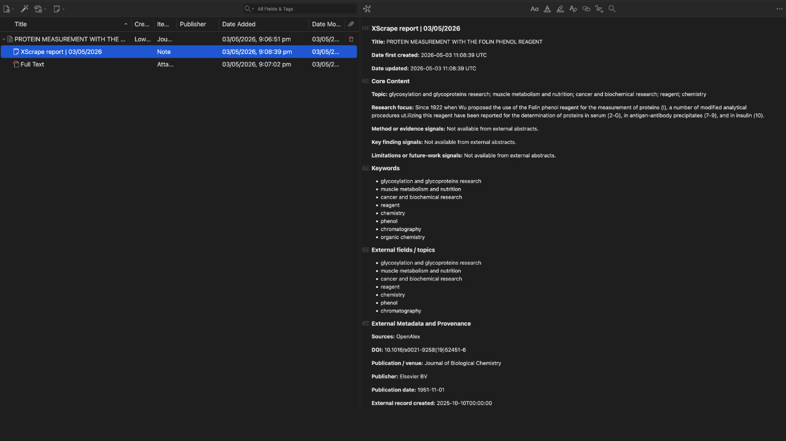
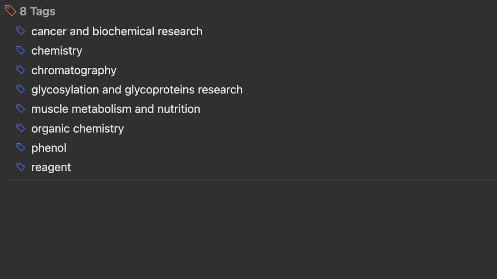

# Scrape, Update & Report

Scrape, Update & Report is a Zotero plugin and Zotero add-on for one-click academic paper metadata scraping, DOI metadata updates, safe bibliographic field updates, keyword tagging, and discrepancy reports from DBLP, Semantic Scholar, and OpenAlex.

This repository is a maintained fork of [Creling/Zotero-Metadata-Scraper](https://github.com/Creling/Zotero-Metadata-Scraper). It remains licensed under AGPL-3.0-or-later.

Project page: [https://aderavi.github.io/zotero-scrape-update-report/](https://aderavi.github.io/zotero-scrape-update-report/)

Useful search terms: Zotero metadata scraper; Zotero metadata updater; Zotero DOI metadata; Zotero bibliographic metadata updater; Zotero keyword extraction; Zotero keyword tags; OpenAlex Zotero plugin; Semantic Scholar Zotero plugin; DBLP Zotero plugin; literature review Zotero tool; systematic review Zotero add-on; scoping review Zotero add-on; PRISMA Zotero workflow.

## How to use

Right-click the Zotero parent item and choose **Scrape, Update & Report** from the item menu. The plugin creates a child scrape report note, updates safe bibliographic fields, and adds extracted keywords as Zotero tags.







## What It Does

- Adds one Zotero item context-menu command: **Scrape, Update & Report**.
- Works as a Zotero metadata scraper, DOI metadata updater, bibliographic metadata cleaner, and keyword tag generator.
- Looks up selected papers in DBLP, Semantic Scholar, and OpenAlex.
- Cross-checks external records against the Zotero item title, DOI, and date before writing fields.
- Updates standard Zotero bibliographic fields instead of putting bibliographic data into `Extra`.
- Writes abstracts to Zotero's standard Abstract field.
- Adds external keywords as Zotero tags.
- Creates or updates a child note headed `Scrape report | DD/MM/YYYY`.
- Creates a separate `Scrape error report | DD/MM/YYYY` child note when external metadata is unsafe or inconsistent.
- Uses a theme-aware pickaxe icon for light and dark Zotero themes.

## Safety Model

The plugin treats an exact DOI match as a trusted external identity signal, but it still checks the title and date before writing fields. If the DOI matches but the title or date differs from the current Zotero item, Zotero shows a modal before any standard fields are changed.

If a discrepancy is found, Zotero shows a modal with:

- current Zotero title/date/DOI
- external title/date/DOI
- **Update** to intentionally force the external update
- **Cancel** to stop the update

An error report note is created for auditability.

## Data Sources

- [DBLP](https://dblp.org/)
- [Semantic Scholar](https://www.semanticscholar.org/product/api)
- [OpenAlex](https://openalex.org/)

Semantic Scholar works without an API key, but an API key is recommended for higher rate limits.

## Installation

1. Download the latest `.xpi` file from this repository's releases.
2. In Zotero, open **Tools → Add-ons**.
3. Click the gear icon and choose **Install Add-on From File...**.
4. Select the downloaded `.xpi`.
5. Restart Zotero if prompted.

## Usage

1. Select one or more regular Zotero items.
2. Right-click the item selection.
3. Choose **Scrape, Update & Report**.
4. Review any discrepancy modal before allowing forced changes.

## Notes Created

### Scrape Report

The normal child note includes:

- title
- date first created
- date updated
- topic and research-focus signals
- method/evidence signals
- finding and limitation signals
- keywords
- external fields/topics
- provenance, identifiers, open-access, citation, FWCI, and retraction information where available
- source cross-checks

### Error Report

The error child note includes:

- the reason the scrape/update could not safely continue
- what matched and what did not match across title, date, and DOI
- rejected external candidates and their source-level reason where available

## Development

### Requirements

- Node.js 20+
- npm
- Zotero 7, 8, or 9

### Install Dependencies

```bash
npm install
```

### Build

```bash
npm run build
```

The scaffold writes build output under `.scaffold/build`.

### Development Server

```bash
npm run start
```

### Lint

```bash
npm run lint:check
npm run lint:fix
```

## Releasing

The release workflow is inherited from the upstream Zotero plugin scaffold. Tag a release with:

```bash
git tag vX.Y.Z
git push origin vX.Y.Z
```

GitHub Actions will build and publish release assets when repository Actions are enabled.

## License and Attribution

Licensed under [AGPL-3.0-or-later](LICENSE).

Original project: [Creling/Zotero-Metadata-Scraper](https://github.com/Creling/Zotero-Metadata-Scraper), copyright creling.

This fork adds Zotero 9 compatibility range, one-click scrape/update/report flow, DBLP/Semantic Scholar/OpenAlex cross-checking, safer identity matching, discrepancy/error notes, keyword tagging, and theme-aware icon updates.
